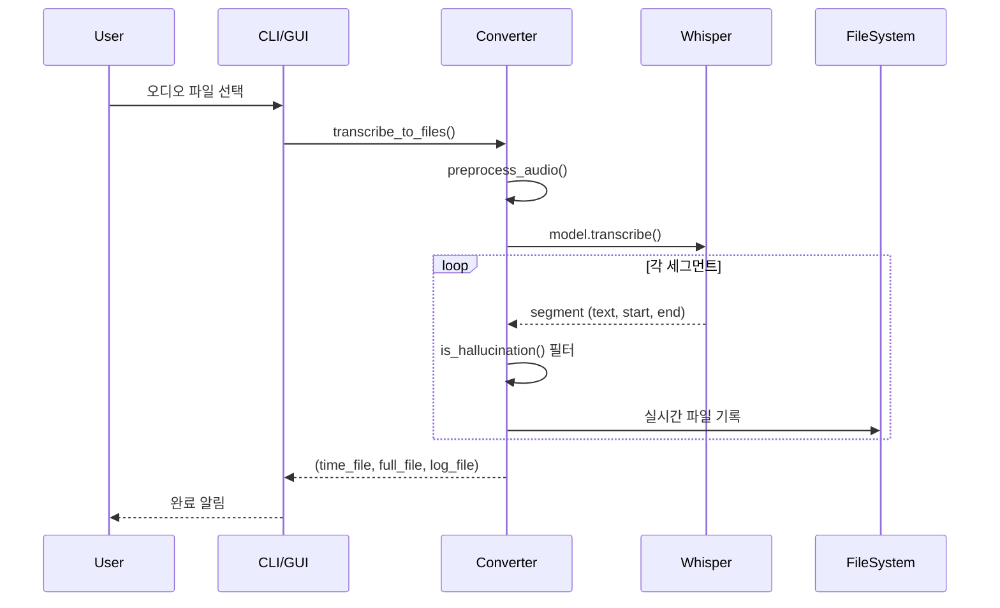

# 🔧 TRD - Technical Requirements Document
## MP3 to Text Converter

---

## 1. 시스템 아키텍처

```
┌─────────────────────────────────────────────────────────────┐
│                      User Interface                          │
├─────────────────────┬─────────────────────┬─────────────────┤
│     CLI (argparse)  │   GUI (Gradio)      │   Python API    │
└─────────────────────┴─────────────────────┴─────────────────┘
                              │
                              ▼
┌─────────────────────────────────────────────────────────────┐
│                   MP3ToTextConverter                         │
│  ┌─────────────┐  ┌─────────────┐  ┌─────────────────────┐  │
│  │ Preprocess  │→ │  Whisper    │→ │ Post-process        │  │
│  │ (16kHz mono)│  │  Model      │  │ (Filter, Format)    │  │
│  └─────────────┘  └─────────────┘  └─────────────────────┘  │
└─────────────────────────────────────────────────────────────┘
                              │
                              ▼
┌─────────────────────────────────────────────────────────────┐
│                    Output Files                              │
│  ┌──────────┐  ┌──────────┐  ┌──────────┐                   │
│  │_full.md  │  │_time.md  │  │ log/*.md │                   │
│  └──────────┘  └──────────┘  └──────────┘                   │
└─────────────────────────────────────────────────────────────┘
```

---

## 2. 기술 스택

### 2.1 Core
| 구분 | 기술 | 버전 |
|------|------|------|
| Language | Python | 3.10+ |
| ML Model | faster-whisper | latest |
| Audio Processing | ffmpeg | 6.0+ |

### 2.2 GUI
| 구분 | 기술 | 버전 |
|------|------|------|
| Web Framework | Gradio | 4.x |
| Server | Uvicorn | latest |

### 2.3 Dependencies
```
faster-whisper>=0.9.0
gradio>=4.0.0
pydub>=0.25.0
```

---

## 3. 핵심 컴포넌트

### 3.1 MP3ToTextConverter 클래스

```python
class MP3ToTextConverter:
    def __init__(self, model_size, device, language, use_vad, use_context)
    def transcribe(self, audio_path, show_timestamps, show_progress) -> dict
    def transcribe_to_files(self, audio_path, output_base, time_interval) -> tuple
    def _transcribe_generator(self, audio_path, show_progress) -> Generator
    def is_hallucination(self, text) -> bool
```

### 3.2 주요 함수

| 함수 | 역할 |
|------|------|
| `preprocess_audio()` | 16kHz 모노로 변환 |
| `get_audio_duration()` | 오디오 길이 반환 |
| `format_time()` | 초를 MM:SS 형식으로 변환 |

---

## 4. 데이터 흐름

### 4.1 변환 프로세스


### 4.2 실시간 저장 메커니즘
- Generator 기반 스트리밍 처리
- 세그먼트 단위 파일 append
- KeyboardInterrupt 시 안전한 종료

---

## 5. 설정 및 파라미터

### 5.1 모델 설정
| 파라미터 | 기본값 | 설명 |
|----------|--------|------|
| model_size | large-v3 | Whisper 모델 크기 |
| device | auto | cuda/cpu 자동 선택 |
| compute_type | int8 (CPU) / float16 (GPU) | 연산 정밀도 |

### 5.2 변환 설정
| 파라미터 | 기본값 | 설명 |
|----------|--------|------|
| language | ko | 인식 언어 |
| use_vad | True | 음성 구간 감지 |
| temperature | 0 | 샘플링 온도 (결정론적) |
| beam_size | 5 | 빔 서치 크기 |

### 5.3 VAD 설정
| 파라미터 | 값 | 설명 |
|----------|-----|------|
| threshold | 0.05 | 민감도 (낮을수록 민감) |
| min_speech_duration_ms | 50 | 최소 음성 길이 |
| min_silence_duration_ms | 50 | 최소 무음 길이 |

---

## 6. 에러 처리

### 6.1 예외 클래스
| 예외 | 상황 |
|------|------|
| FileNotFoundError | 오디오 파일 없음 |
| RuntimeError | 모델 로딩 실패 |
| KeyboardInterrupt | 사용자 중단 (정상 처리) |

### 6.2 복구 전략
- 실시간 저장으로 중단 시에도 데이터 유지
- 임시 파일 자동 정리

---

## 7. 성능 최적화

### 7.1 현재 적용
- int8 양자화 (CPU)
- 16kHz 다운샘플링
- VAD 기반 불필요 구간 스킵

### 7.2 향후 계획
- GPU 가속 (CUDA)
- 청크 기반 병렬 처리
- 캐시 활용

---

*문서 버전: 1.0*
*최종 수정: 2026-01-11*
