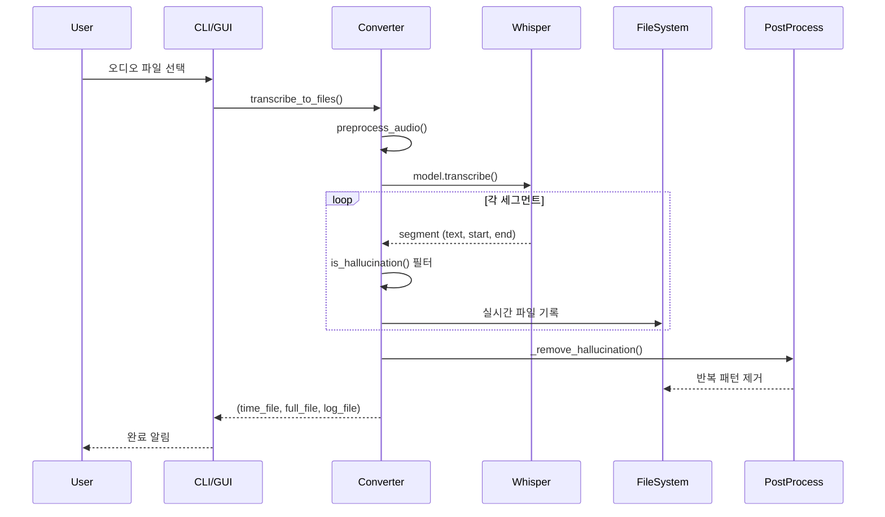
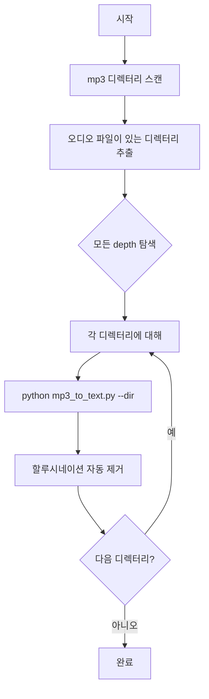

# 🔧 TRD - Technical Requirements Document
## MP3 to Text Converter

---

## 1. 시스템 아키텍처

```
┌─────────────────────────────────────────────────────────────────────────────┐
│                           User Interface                                      │
├───────────────┬───────────────┬───────────────┬───────────────┬─────────────┤
│ CLI (argparse)│ GUI (Gradio)  │ Web UI (Flask)│ GUI (Tkinter) │ Batch Script│
│               │ port 7860     │ port 5001     │ native        │convert_all  │
└───────────────┴───────────────┴───────────────┴───────────────┴─────────────┘
                                    │
                                    ▼
┌─────────────────────────────────────────────────────────────────────────────┐
│                        MP3ToTextConverter                                    │
│  ┌─────────────┐  ┌─────────────┐  ┌─────────────┐  ┌─────────────┐        │
│  │ Preprocess  │→ │  Whisper    │→ │ Hallucinate │→ │ Post-clean  │        │
│  │ (16kHz mono)│  │  Model      │  │ Filter      │  │ (_remove_*) │        │
│  └─────────────┘  └─────────────┘  └─────────────┘  └─────────────┘        │
└─────────────────────────────────────────────────────────────────────────────┘
                                    │
                                    ▼
┌─────────────────────────────────────────────────────────────────────────────┐
│                           Output Files                                        │
│  ┌──────────┐  ┌──────────┐  ┌──────────┐                                    │
│  │_full.md  │  │_time.md  │  │ log/*.md │                                    │
│  └──────────┘  └──────────┘  └──────────┘                                    │
└─────────────────────────────────────────────────────────────────────────────┘
                                    │
                                    ▼ (옵션)
┌─────────────────────────────────────────────────────────────────────────────┐
│                  fix_hallucination.py (수동 후처리)                          │
│  반복 패턴 감지 → 제거 → 백업 생성 → 파일 정리                                │
└─────────────────────────────────────────────────────────────────────────────┘
```

---

## 2. 기술 스택

### 2.1 Core
| 구분 | 기술 | 버전 |
|------|------|------|
| Language | Python | 3.10+ |
| ML Model | faster-whisper | latest |
| Audio Processing | pydub, ffmpeg | 6.0+ |
| CUDA Support | ctranslate2 | CUDA 12.x |

### 2.2 GUI / Web
| 구분 | 기술 | 용도 |
|------|------|------|
| Gradio | 4.x | 웹 기반 GUI (port 7860) |
| Flask | 3.x | 실시간 모니터링 Web UI (port 5001) |
| Tkinter | 내장 | 네이티브 데스크톱 GUI |
| Uvicorn | latest | Gradio 서버 |

### 2.3 Dependencies
```
faster-whisper>=0.9.0
gradio>=4.0.0
flask>=3.0.0
pydub>=0.25.0
ctranslate2  # CUDA 지원시
werkzeug>=3.0.0  # Flask 파일 업로드용
```

---

## 3. 핵심 컴포넌트

### 3.1 MP3ToTextConverter 클래스

```python
class MP3ToTextConverter:
    def __init__(self, 
                 model_size: str = "large-v3",
                 device: str = "auto",
                 language: str = "ko",
                 use_vad: bool = False,
                 use_context: bool = False,
                 bgm_mode: bool = True,
                 auto_clean_hallucination: bool = True)
    
    def transcribe(self, audio_path, show_timestamps, show_progress) -> dict
    def transcribe_to_files(self, audio_path, output_base, time_interval) -> tuple
    def transcribe_to_file(self, audio_path, output_path, include_timestamps) -> str
    def _transcribe_generator(self, audio_path, show_progress) -> Generator
    def is_hallucination(self, text) -> bool
    def _remove_hallucination(self, time_file) -> int  # 후처리 자동 정리
```

### 3.2 주요 함수

| 함수 | 역할 |
|------|------|
| `preprocess_audio()` | 16kHz 모노로 변환 |
| `get_audio_duration()` | 오디오 길이 반환 (ffprobe 필요) |
| `format_time()` | 초를 MM:SS 형식으로 변환 |

### 3.3 UI 모듈

| 파일 | 역할 | 포트 |
|------|------|------|
| `app_gui.py` | Gradio 웹 GUI | 7860 |
| `web_ui.py` | Flask 실시간 모니터링 UI | 5001 |
| `app_tkinter.py` | Tkinter 네이티브 GUI | - |

### 3.4 독립 도구

| 파일 | 역할 |
|------|------|
| `convert_all.sh` | 디렉터리 일괄 변환 (깊은 depth 지원) |
| `fix_hallucination.py` | 반복 패턴 수동 후처리 |

---

## 4. 데이터 흐름

### 4.1 변환 프로세스


### 4.2 실시간 저장 메커니즘
- Generator 기반 스트리밍 처리
- 세그먼트 단위 파일 append
- KeyboardInterrupt 시 안전한 종료

### 4.3 배치 처리 흐름 (convert_all.sh)


---

## 5. 설정 및 파라미터

### 5.1 모델 설정
| 파라미터 | 기본값 | 설명 |
|----------|--------|------|
| model_size | large-v3 | Whisper 모델 크기 |
| device | auto | cuda/cpu 자동 선택 |
| compute_type | float16 (GPU) / float32 (CPU) | 연산 정밀도 |

### 5.2 변환 설정
| 파라미터 | 기본값 | 설명 |
|----------|--------|------|
| language | ko | 인식 언어 |
| use_vad | False | 음성 구간 감지 (기본: 비활성화) |
| use_context | False | 이전 문맥 참조 (기본: 비활성화) |
| bgm_mode | True | 배경음악 모드 (기본: 활성화) |
| auto_clean_hallucination | True | 자동 할루 제거 |
| temperature | 0 | 샘플링 온도 (결정론적) |
| beam_size | 5 | 빔 서치 크기 |

### 5.3 BGM 모드 설정 (배경음악 위 음성 추출 최적화)
| 파라미터 | 값 | 설명 |
|----------|-----|------|
| no_speech_threshold | 0.2 | 낮춰서 배경음악도 음성 인식 |
| log_prob_threshold | -1.5 | 불확실한 음성도 수용 |
| hallucination_silence_threshold | 0.3 | 환각 억제 |
| vad_threshold | 0.35 | VAD 민감도 증가 |
| vad_min_speech_duration_ms | 200 | 짧은 음성도 인식 |
| vad_min_silence_duration_ms | 1000 | 짧은 침묵 허용 |

### 5.4 VAD 설정 (use_vad=True 시)
| 파라미터 | 값 | 설명 |
|----------|-----|------|
| threshold | 0.35 | 민감도 (BGM 모드 기준) |
| min_speech_duration_ms | 200 | 최소 음성 길이 |
| min_silence_duration_ms | 1000 | 최소 무음 길이 |

---

## 6. CLI 옵션 전체 목록

| 옵션 | 타입 | 기본값 | 설명 |
|------|------|--------|------|
| `audio_file` | str | - | 변환할 오디오 파일 경로 |
| `-o, --output` | str | - | 단일 출력 파일 경로 |
| `-m, --model` | choice | large-v3 | 모델 크기 (small/medium/large/large-v3) |
| `-l, --language` | str | ko | 언어 코드 |
| `--device` | choice | auto | 실행 장치 (auto/cuda/cpu) |
| `-t, --timestamps` | flag | False | 타임스탬프 표시 |
| `--dual` | flag | False | 듀얼 출력 모드 |
| `--interval` | int | 30 | 시간 구간 (초) |
| `--vad` | flag | False | VAD 활성화 |
| `--context` | flag | False | 이전 문맥 참조 활성화 |
| `--no-bgm` | flag | False | BGM 모드 비활성화 |
| `--no-clean` | flag | False | 할루시네이션 자동 제거 비활성화 |
| `--dir` | str | - | 디렉터리 일괄 변환 |

---

## 7. 에러 처리

### 7.1 예외 클래스
| 예외 | 상황 |
|------|------|
| FileNotFoundError | 오디오 파일 없음 |
| RuntimeError | 모델 로딩 실패 |
| KeyboardInterrupt | 사용자 중단 (정상 처리) |

### 7.2 복구 전략
- 실시간 저장으로 중단 시에도 데이터 유지
- 임시 파일 자동 정리
- ffprobe 없어도 변환 가능 (일부 기능 제한)

---

## 8. 성능 최적화

### 8.1 현재 적용
- CUDA GPU 가속 (float16)
- 16kHz 다운샘플링
- BGM 모드 최적화 파라미터
- 자동 할루시네이션 후처리

### 8.2 향후 계획
- 청크 기반 병렬 처리
- 캐시 활용
- 화자 분리

---

*문서 버전: 1.2*
*최종 수정: 2026-01-21*
