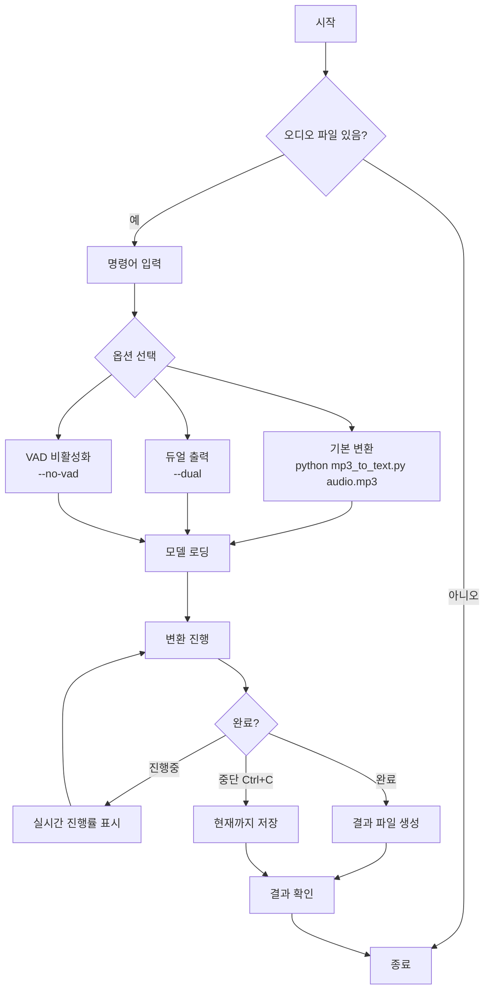
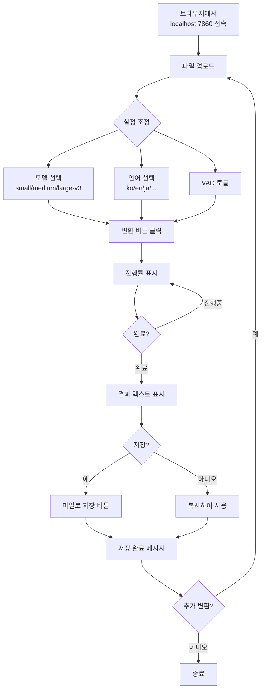
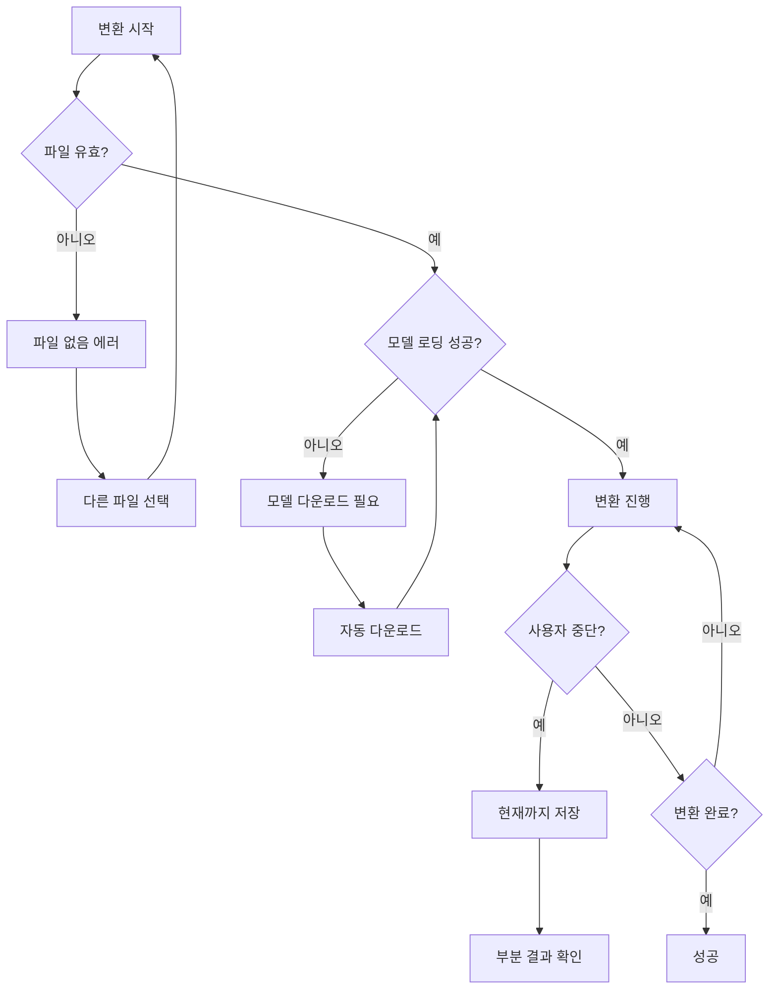

# 🔄 User Flow - 사용자 흐름도
## MP3 to Text Converter

---

## 1. 전체 사용자 여정


---

## 2. CLI 사용자 흐름



### 2.1 CLI 명령어 예시

```bash
# 1. 기본 변환 (콘솔 출력)
python src/mp3_to_text.py audio.mp3

# 2. 파일로 저장
python src/mp3_to_text.py audio.mp3 -o result.txt

# 3. 듀얼 출력 (시간별 + 전체)
python src/mp3_to_text.py audio.mp3 --dual

# 4. VAD 비활성화 (배경음악 있는 경우)
python src/mp3_to_text.py audio.mp3 --dual --no-vad

# 5. 디렉터리 일괄 처리
python src/mp3_to_text.py --dir ./mp3
```

---

## 3. GUI 사용자 흐름



### 3.1 GUI 화면 구성

```
┌─────────────────────────────────────────────────────────────────────┐
│ 🎤 MP3 → 텍스트 변환기                                              │
├───────────────────────────┬─────────────────────────────────────────┤
│                           │                                          │
│  📁 파일 업로드           │  📝 변환 결과                            │
│  ┌─────────────────────┐  │  ┌────────────────────────────────────┐ │
│  │ [audio.mp3 ▼]       │  │  │                                    │ │
│  └─────────────────────┘  │  │  FM영화음악 정은임입니다.          │ │
│                           │  │  오늘 첫 번째 곡은...              │ │
│  ⚙️ 설정                  │  │                                    │ │
│  모델: [large-v3 ▼]       │  │                                    │ │
│  언어: [ko ▼]             │  │                                    │ │
│  ☑ VAD 활성화             │  │                                    │ │
│                           │  │                                    │ │
│  [🎯 변환 시작]           │  └────────────────────────────────────┘ │
│                           │                                          │
│  ⏳ 진행 상황             │  [💾 파일로 저장]                        │
│  ████████░░░░ 65%         │                                          │
│  12:30/19:00 ETA: 2:15    │                                          │
│                           │                                          │
└───────────────────────────┴─────────────────────────────────────────┘
```

---

## 4. 에러 상황 흐름



---

## 5. 출력 파일 구조

```
mp3/
├── audio.mp3                 # 원본 오디오
├── audio_full.md             # 전체 텍스트
├── audio_time.md             # 시간대별 텍스트
└── log/
    └── 2026-01-11.md         # 일자별 변환 로그
```

---

*문서 버전: 1.0*
*최종 수정: 2026-01-11*
