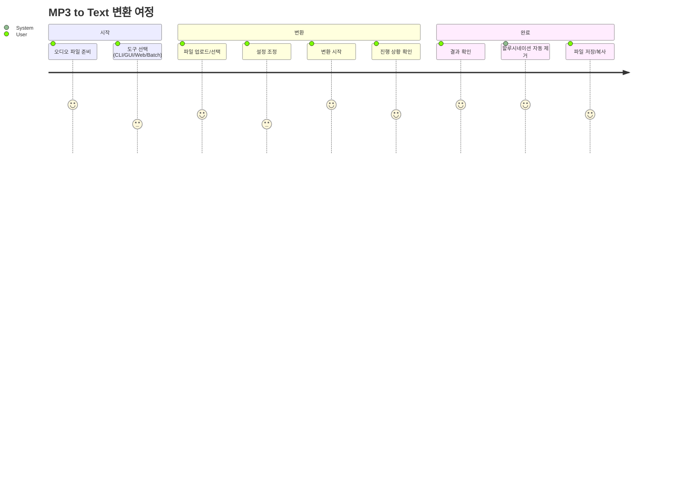
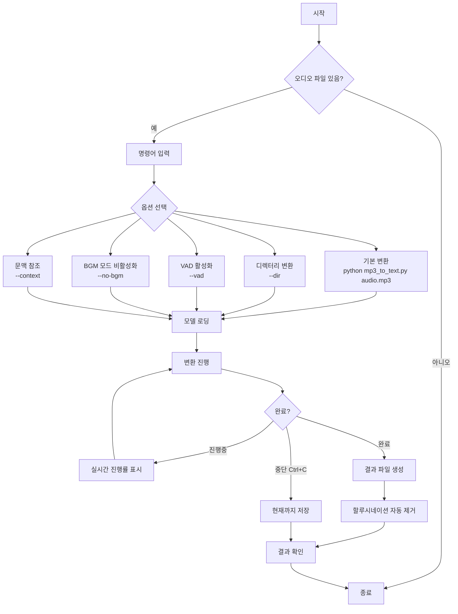
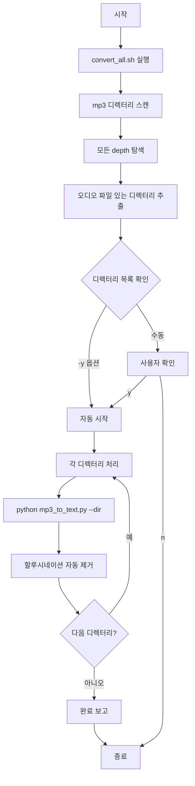
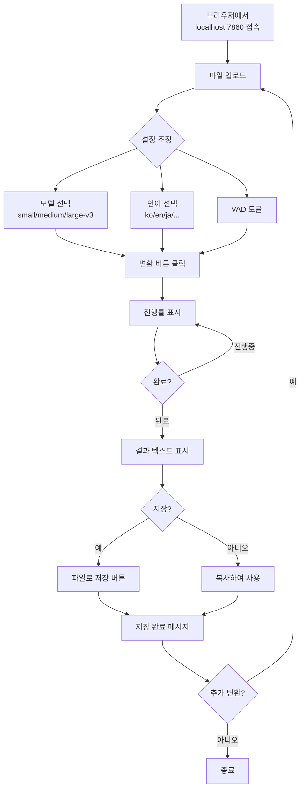
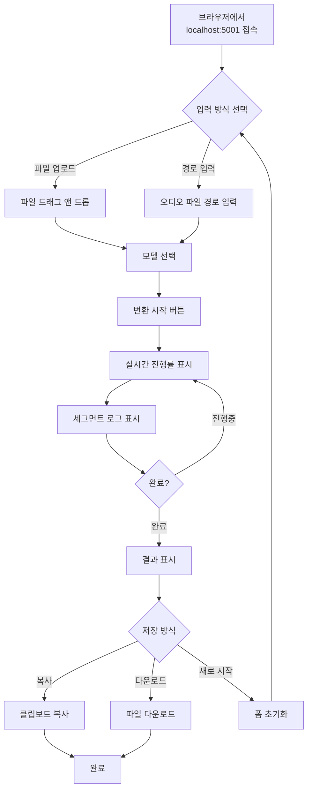
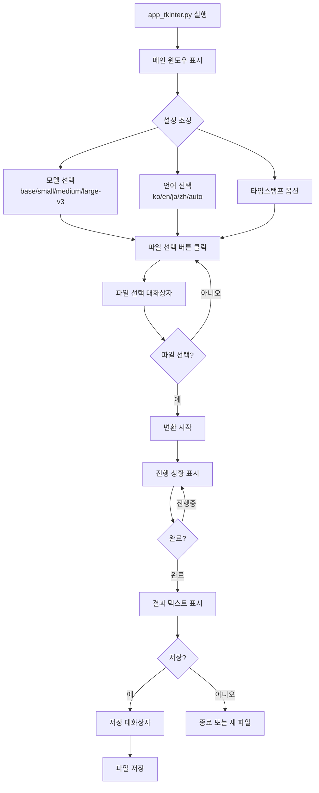
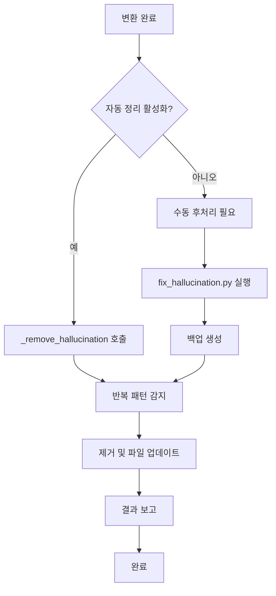
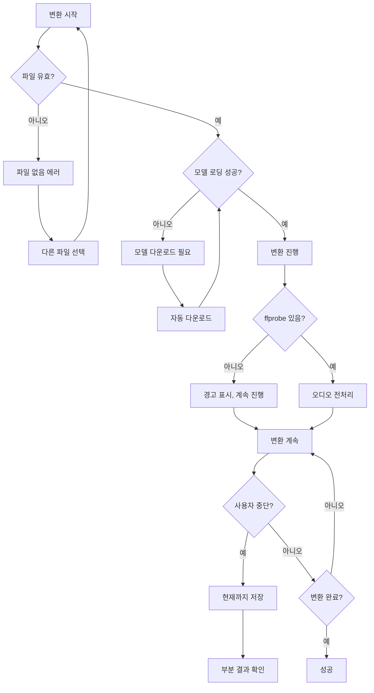

# 🔄 User Flow - 사용자 흐름도
## MP3 to Text Converter

---

## 1. 전체 사용자 여정



---

## 2. CLI 사용자 흐름



### 2.1 CLI 명령어 예시

```bash
# 1. 기본 변환 (자동으로 _time.md, _full.md 생성)
python src/mp3_to_text.py audio.mp3

# 2. 파일로 저장 (단일 txt)
python src/mp3_to_text.py audio.mp3 -o result.txt

# 3. VAD 활성화 (음성 구간만 처리)
python src/mp3_to_text.py audio.mp3 --vad

# 4. 디렉터리 일괄 처리
python src/mp3_to_text.py --dir ./mp3

# 5. 시간 간격 조정 (60초 단위)
python src/mp3_to_text.py --dir ./mp3 --interval 60

# 6. BGM 모드 비활성화 (일반 음성용)
python src/mp3_to_text.py audio.mp3 --no-bgm

# 7. 이전 문맥 참조 활성화
python src/mp3_to_text.py audio.mp3 --context
```

---

## 3. 일괄 변환 (Batch) 사용자 흐름



### 3.1 Batch 명령어 예시

```bash
# 1. 기본 실행 (확인 프롬프트)
./convert_all.sh

# 2. 백그라운드 실행 (nohup)
nohup ./convert_all.sh -y > convert_all.log 2>&1 &

# 3. VAD 활성화
./convert_all.sh --vad -y

# 4. 시간 간격 조정
./convert_all.sh --interval 60 -y

# 5. 진행 상황 확인
tail -f convert_all.log
```

---

## 4. Gradio GUI 사용자 흐름



### 4.1 Gradio GUI 화면 구성

```
┌─────────────────────────────────────────────────────────────────────┐
│ 🎤 MP3 → 텍스트 변환기                                              │
├───────────────────────────┬─────────────────────────────────────────┤
│                           │                                          │
│  📁 파일 업로드           │  📝 변환 결과                            │
│  ┌─────────────────────┐  │  ┌────────────────────────────────────┐ │
│  │ [audio.mp3 ▼]       │  │  │                                    │ │
│  └─────────────────────┘  │  │  FM영화음악 정은임입니다.          │ │
│                           │  │  오늘 첫 번째 곡은...              │ │
│  ⚙️ 설정                  │  │                                    │ │
│  모델: [large-v3 ▼]       │  │                                    │ │
│  언어: [ko ▼]             │  │                                    │ │
│  ☐ VAD 활성화             │  │                                    │ │
│                           │  │                                    │ │
│  [🎯 변환 시작]           │  └────────────────────────────────────┘ │
│                           │                                          │
│  ⏳ 진행 상황             │  [💾 저장]                               │
│  ████████░░░░ 65%         │                                          │
│  12:30/19:00 ETA: 2:15    │                                          │
│                           │                                          │
└───────────────────────────┴─────────────────────────────────────────┘
```

---

## 5. Flask Web UI 사용자 흐름



### 5.1 Flask Web UI 화면 구성

```
┌─────────────────────────────────────────────────────────────────────┐
│ 🎤 MP3 → Text Converter                                             │
├─────────────────────────────────────────────────────────────────────┤
│                                                                      │
│  📁 오디오 파일 선택                                                 │
│  ┌─────────────────┬─────────────────┐                              │
│  │ 📤 파일 업로드  │ 📂 경로 입력    │  ← 탭 전환                   │
│  └─────────────────┴─────────────────┘                              │
│                                                                      │
│  ┌─────────────────────────────────────┐                            │
│  │ 클릭하거나 파일을 드래그하세요      │                            │
│  │ MP3, WAV, FLAC, M4A 지원            │                            │
│  └─────────────────────────────────────┘                            │
│                                                                      │
│  모델 선택: [Large-v3 (~3GB) ▼]                                     │
│                                                                      │
│  [🚀 변환 시작]                                                      │
│                                                                      │
├─────────────────────────────────────────────────────────────────────┤
│  📊 진행 상황                                                        │
│  ┌─────────────────────────────┐                                    │
│  │ ⏳ 변환 중...               │                                    │
│  │ ████████████░░░░░░ 65%      │                                    │
│  │ 세그먼트: 45개 | 경과: 3:20 │                                    │
│  └─────────────────────────────┘                                    │
│                                                                      │
│  📜 실시간 로그                                                      │
│  ┌─────────────────────────────────────────────────────────────┐    │
│  │ [0.00s → 2.50s] FM영화음악 정은임입니다.                    │    │
│  │ [2.50s → 5.30s] 오늘 첫 번째 곡은...                        │    │
│  └─────────────────────────────────────────────────────────────┘    │
│                                                                      │
├─────────────────────────────────────────────────────────────────────┤
│  ✅ 변환 완료                                                        │
│  [📋 복사] [💾 다운로드] [🔄 새로 시작]                             │
│  ┌─────────────────────────────────────────────────────────────┐    │
│  │ 변환된 전체 텍스트...                                       │    │
│  └─────────────────────────────────────────────────────────────┘    │
│                                                                      │
└─────────────────────────────────────────────────────────────────────┘
```

---

## 6. Tkinter GUI 사용자 흐름



### 6.1 Tkinter GUI 화면 구성

```
┌─────────────────────────────────────────────────────────────────────┐
│ 🎤 MP3 → 텍스트 변환기                                              │
│ 완전 무료 · 로컬 실행 · 한국어 최적화                               │
├─────────────────────────────────────────────────────────────────────┤
│  모델:  ○ base (빠름)  ○ small (양호)  ○ medium (추천)             │
│         ○ large-v3 (최고)                                           │
│                                                                      │
│  언어:  [ko (한국어) ▼]        ☐ 타임스탬프 표시                    │
├─────────────────────────────────────────────────────────────────────┤
│  [📁 파일 선택 및 변환]  [💾 저장]              상태: 준비됨        │
├─────────────────────────────────────────────────────────────────────┤
│  📝 변환 결과                                                        │
│  ┌─────────────────────────────────────────────────────────────┐    │
│  │                                                              │    │
│  │  변환된 텍스트가 여기에 표시됩니다...                        │    │
│  │                                                              │    │
│  │                                                              │    │
│  │                                                              │    │
│  └─────────────────────────────────────────────────────────────┘    │
└─────────────────────────────────────────────────────────────────────┘
```

---

## 7. 할루시네이션 후처리 흐름



### 7.1 수동 후처리 명령어

```bash
# 1. 기본 실행 (백업 자동 생성)
python src/fix_hallucination.py audio_time.md

# 2. 상세 정보 출력
python src/fix_hallucination.py audio_time.md -v

# 3. 백업 없이 처리
python src/fix_hallucination.py audio_time.md --no-backup

# 4. 반복 임계값 조정 (기본: 3)
python src/fix_hallucination.py audio_time.md --threshold 5

# 5. 전체 디렉터리 일괄 처리
find mp3 -name "*_time.md" | while read f; do
    python src/fix_hallucination.py "$f" --no-backup
done
```

---

## 8. 에러 상황 흐름



---

## 9. 출력 파일 구조

```
mp3/
├── audio.mp3                 # 원본 오디오
├── audio_full.md             # 전체 텍스트
├── audio_time.md             # 시간대별 텍스트
├── subdirectory/             # 깊은 depth도 지원
│   ├── audio2.mp3
│   ├── audio2_full.md
│   └── audio2_time.md
└── log/
    └── 2026-01-21.md         # 일자별 변환 로그
```

---

*문서 버전: 1.2*
*최종 수정: 2026-01-21*
